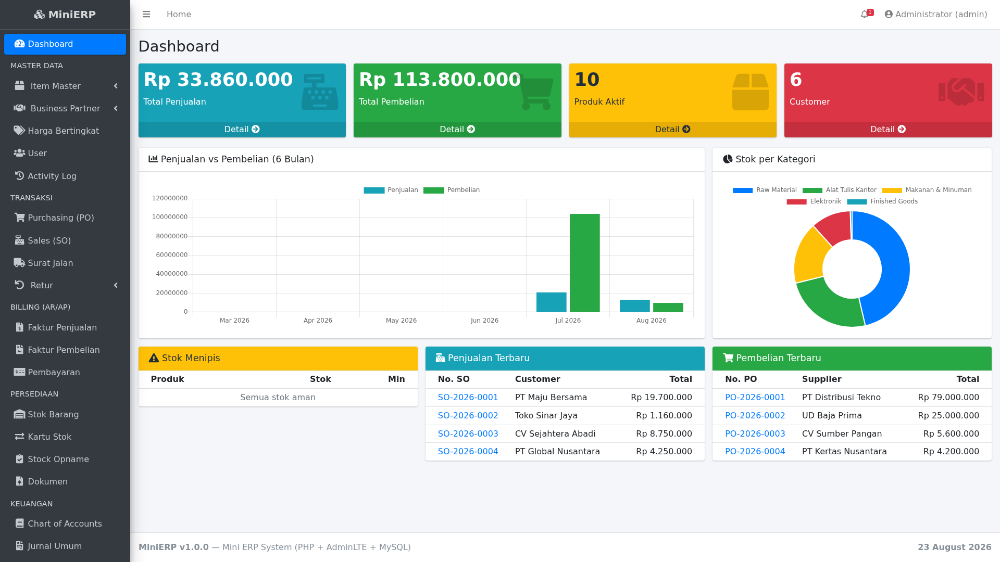

# MiniERP - Sistem ERP seperti SAP (PHP + AdminLTE + MySQL)

Aplikasi ERP mini yang meniru alur kerja sistem ERP enterprise (seperti SAP),
dibangun dengan PHP native, template AdminLTE 3, dan database MySQL/MariaDB.

## 📚 Dokumentasi

| Dokumen | Isi |
|---|---|
| **[📘 User Guide](docs/USER_GUIDE.md)** | Panduan pengguna lengkap dengan screenshot — cara pakai setiap modul |
| **[📗 Module Guide](docs/MODULE_GUIDE.md)** | Dokumentasi teknis — tabel, workflow, integrasi jurnal, REST API |
| **[🖼️ Screenshots](docs/screenshots/)** | 13+ screenshot aplikasi |



## Modul

| Modul | Fitur |
|---|---|
| **Dashboard** | KPI penjualan/pembelian, grafik 6 bulan, stok per kategori, peringatan stok menipis |
| **Master Data** | Produk (Item Master), Kategori, Customer & Supplier (Business Partner), User dengan role, **Harga Bertingkat** |
| **Purchasing** | Purchase Order dengan workflow `DRAFT → APPROVED → RECEIVED` (Goods Receipt) |
| **Sales** | Sales Order dengan workflow `DRAFT → CONFIRMED → DELIVERED` |
| **Delivery** | Surat Jalan dengan pengiriman parsial (partial delivery) |
| **Returns** | Retur Penjualan & Pembelian dengan stock reversal + jurnal otomatis |
| **Billing (AR/AP)** | Faktur Penjualan & Pembelian, Pembayaran (termin), status UNPAID/PARTIAL/PAID/OVERDUE |
| **Inventory** | Posisi stok, kartu stok, penyesuaian stok, **Stock Opname** (hitung fisik) |
| **Finance** | Chart of Accounts, Jurnal Umum (debit/kredit seimbang) |
| **Reports** | Laporan Penjualan, Pembelian, Stok, dan Laba Rugi (dapat diprint & export CSV) |
| **CRM** | Leads, Opportunities (pipeline), konversi lead ke customer |
| **Tax** | Master pajak (PPN/PPH), e-Faktur, perhitungan otomatis |
| **Branches** | Multi-cabang dengan gudang default per cabang |
| **Shipment** | Tracking pengiriman dengan carrier & nomor resi |
| **Landed Cost** | Alokasi biaya kirim/bea masuk ke produk (by value/quantity) |
| **Commission** | Komisi salesman dari penjualan per periode |
| **Service** | Helpdesk ticket, Knowledge Base, SLA tracking |
| **Documents** | Upload & lampiran dokumen dengan referensi |
| **Currency** | Multi-currency dengan kurs harian |
| **Approval** | Approval matrix multi-level dengan rule amount-based |
| **Forecast** | Sales forecast & MRP (material requirements planning) |
| **API** | REST API endpoint JSON untuk integrasi external |
| **System** | **Activity Log / Audit Trail**, **Company Settings** |

## Fitur Integrasi (seperti SAP)

- **Goods Receipt** (PO → RECEIVED): stok otomatis bertambah, kartu stok tercatat, dan jurnal otomatis dibuat (Persediaan D / Hutang K).
- **Delivery** (SO → DELIVERED): stok otomatis berkurang, kartu stok tercatat, jurnal penjualan (Piutang D / Pendapatan K) dan HPP (HPP D / Persediaan K) otomatis dibuat.
- **Surat Jalan (DO)**: pengiriman parsial per item, stok berkurang saat DO dibuat, SO otomatis DELIVERED jika semua terkirim.
- **Invoice & Payment**: Faktur otomatis dari SO/PO, pembayaran termin dengan auto-jurnal (Bank D / Piutang K atau Hutang D / Bank K).
- **Retur**: retur penjualan mengembalikan stok + jurnal retur; retur pembelian mengurangi stok + jurnal retur.
- **Stock Opname**: hitung fisik vs sistem, selisih otomatis disesuaikan via stock movements.
- **Harga Bertingkat**: harga khusus per customer per produk, auto-apply di form penjualan via AJAX.
- **Notifikasi**: bell icon di navbar untuk invoice jatuh tempo, stok minimum, PO menunggu approval.
- Validasi stok saat delivery — tidak bisa kirim jika stok kurang.
- Penomoran dokumen otomatis: `PO-2026-0001`, `SO-2026-0001`, `DO-2026-0001`, `SI-2026-0001`, `PI-2026-0001`, `RCV-2026-0001`, `SR-2026-0001`, `PR-2026-0001`, `OPN-2026-0001`, `JE-2026-0001`.

## Kebutuhan

- PHP 8+ dengan ekstensi `pdo_mysql`
- MySQL / MariaDB

## Instalasi

```bash
# 1. Buat database
mysql -u root -e "CREATE DATABASE erp_db"

# 2. Import schema & seed data (v1)
mysql -u root erp_db < database/schema.sql
mysql -u root erp_db < database/seed.sql

# 3. Import migration v2, v3, v4 (fitur enterprise)
mysql -u root erp_db < database/migration_v2.sql
mysql -u root erp_db < database/migration_v3.sql
mysql -u root erp_db < database/seed_v3.sql
mysql -u root erp_db < database/migration_v4.sql
mysql -u root erp_db < database/seed_v4.sql

# 4. Sesuaikan koneksi di config/config.php

# 5. Jalankan
php -S localhost:8000
```

Buka http://localhost:8000

## Login Demo

| Username | Password | Role |
|---|---|---|
| admin | admin123 | admin |
| manager | admin123 | manager |
| staff | admin123 | staff |

## Struktur Folder

```
erp/
├── index.php            # Front controller / router
├── config/config.php    # Konfigurasi DB & aplikasi
├── core/                # Database (PDO), Auth, helper functions
├── layouts/             # Header, sidebar, footer (AdminLTE)
├── modules/             # Modul per fitur (auth, dashboard, master, transaksi, dll)
├── assets/adminlte/     # AdminLTE 3.2 (offline)
└── database/            # schema.sql & seed.sql
```

Setiap modul mengikuti pola yang sama:
- `module_handle()` — memproses aksi POST sebelum output
- `module_render()` — menampilkan HTML
- `module_scripts()` — JavaScript per halaman (opsional)
