# 📘 Panduan Pengguna MiniERP v4.0

**MiniERP — Enterprise Resource Planning System**
Sistem manajemen bisnis terintegrasi (seperti SAP) berbasis web.

---

## Daftar Isi

1. [Pengenalan Sistem](#1-pengenalan-sistem)
2. [Login & Navigasi](#2-login--navigasi)
3. [Dashboard](#3-dashboard)
4. [Master Data](#4-master-data)
5. [Purchasing (Pembelian)](#5-purchasing-pembelian)
6. [Sales (Penjualan)](#6-sales-penjualan)
7. [Inventory & Gudang](#7-inventory--gudang)
8. [Billing (Keuangan AR/AP)](#8-billing-keuangan-arap)
9. [Finance & Akuntansi](#9-finance--akuntansi)
10. [HR & Payroll](#10-hr--payroll)
11. [Manufacturing (Produksi)](#11-manufacturing-produksi)
12. [Project Management](#12-project-management)
13. [POS (Kasir)](#13-pos-kasir)
14. [CRM](#14-crm)
15. [Aset, QC & Lainnya](#15-aset-qc--lainnya)
16. [Laporan](#16-laporan)
17. [Troubleshooting](#17-troubleshooting)

---

## 1. Pengenalan Sistem

MiniERP adalah sistem ERP yang meniru alur kerja sistem enterprise seperti SAP, meliputi modul:

- **MM** (Materials Management) — Produk, Stok, Gudang
- **SD** (Sales & Distribution) — Sales Order, Surat Jalan, Faktur
- **PP** (Production Planning) — BOM, Work Order
- **FI** (Financial Accounting) — Jurnal, GL, Neraca, Laba Rugi
- **CO** (Controlling) — Budget, Komisi
- **HR** (Human Resources) — Karyawan, Absensi, Payroll
- **CRM** — Leads, Opportunities
- **POS** — Point of Sale

### Kebutuhan Sistem
- PHP 8.0+, MySQL/MariaDB, Web Server (Apache/Nginx/built-in PHP)
- Browser modern (Chrome, Firefox, Edge)

---

## 2. Login & Navigasi

### 2.1 Cara Login

1. Buka alamat aplikasi di browser, misal `http://localhost/ERP`
2. Masukkan **Username** dan **Password**
3. Klik tombol **Login**

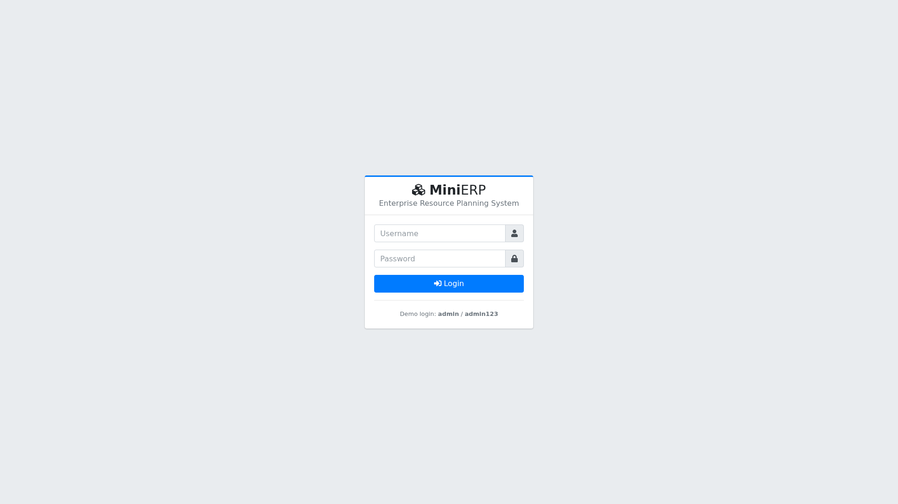

**Akun Demo:**

| Username | Password | Role | Akses |
|---|---|---|---|
| `admin` | `admin123` | Admin | Semua modul |
| `manager` | `admin123` | Manager | Transaksi + approval |
| `staff` | `admin123` | Staff | Transaksi dasar |

### 2.2 Antarmuka Utama

Setelah login Anda melihat:
- **Sidebar kiri** — menu semua modul
- **Navbar atas** — notifikasi (lonceng) dan profil user
- **Konten utama** — area kerja modul yang dipilih

---

## 3. Dashboard

Dashboard menampilkan ringkasan bisnis secara real-time:


**Yang ditampilkan:**
- **KPI Cards** — Total Penjualan, Total Pembelian, Produk Aktif, Jumlah Customer
- **Grafik Bar** — Perbandingan Penjualan vs Pembelian 6 bulan terakhir
- **Grafik Donut** — Komposisi stok per kategori produk
- **Widget Stok Menipis** — produk yang stoknya di bawah batas minimum
- **Penjualan & Pembelian Terbaru** — 5 transaksi terakhir

---

## 4. Master Data

### 4.1 Produk (Item Master)

**Menu: Master Data → Item Master → Produk**

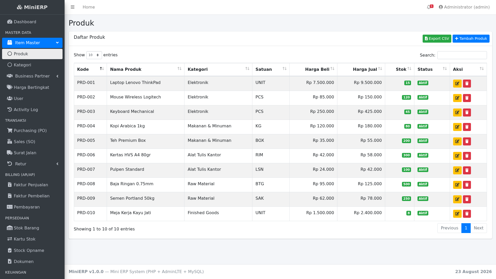

**Cara menambah produk:**
1. Klik tombol **Tambah Produk**
2. Isi: Kode, Nama, Kategori, Satuan, Harga Beli, Harga Jual, Stok Awal, Stok Minimum
3. Klik **Simpan**

**Fitur:**
- Badge hijau/merah menandakan stok aman/menipis
- Tombol **Export CSV** untuk download data ke Excel
- Edit/hapus via ikon di kolom Aksi

### 4.2 Business Partner (Customer & Supplier)

**Menu: Master Data → Business Partner**

Kelola data Customer (pelanggan) dan Supplier (pemasok) dengan kode unik, kontak, dan alamat.

### 4.3 Harga Bertingkat

**Menu: Master Data → Harga Bertingkat**

Mengatur harga khusus per customer per produk. Harga ini otomatis dipakai saat membuat Sales Order untuk customer tersebut.

---

## 5. Purchasing (Pembelian)

### 5.1 Purchase Order (PO)

**Menu: Transaksi → Purchasing (PO)**

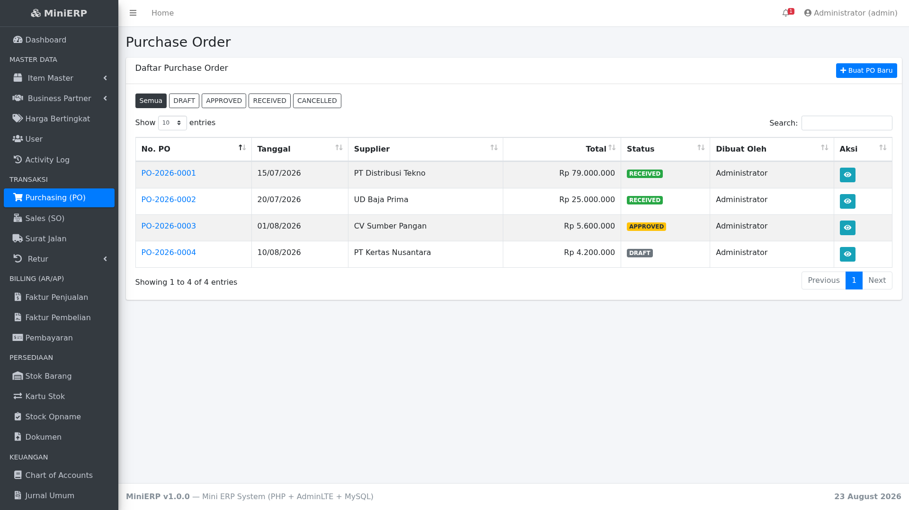

**Workflow PO: `DRAFT → APPROVED → RECEIVED`**

**Langkah membuat PO:**
1. Klik **Buat PO Baru**
2. Pilih **Supplier**, isi tanggal & catatan
3. Tambahkan item: pilih produk, qty, harga beli (otomatis terisi dari master)
4. Klik **Simpan PO** → status DRAFT

**Langkah approval & penerimaan:**
1. Buka detail PO (klik nomor PO)
2. Klik **Approve** → status APPROVED
3. Klik **Terima Barang (Goods Receipt)** → status RECEIVED

> 💡 **Otomatisasi saat RECEIVED:** stok produk bertambah, kartu stok tercatat, dan jurnal otomatis dibuat (Persediaan D / Hutang Usaha K).

---

## 6. Sales (Penjualan)

### 6.1 Sales Order (SO)

**Menu: Transaksi → Sales (SO)**

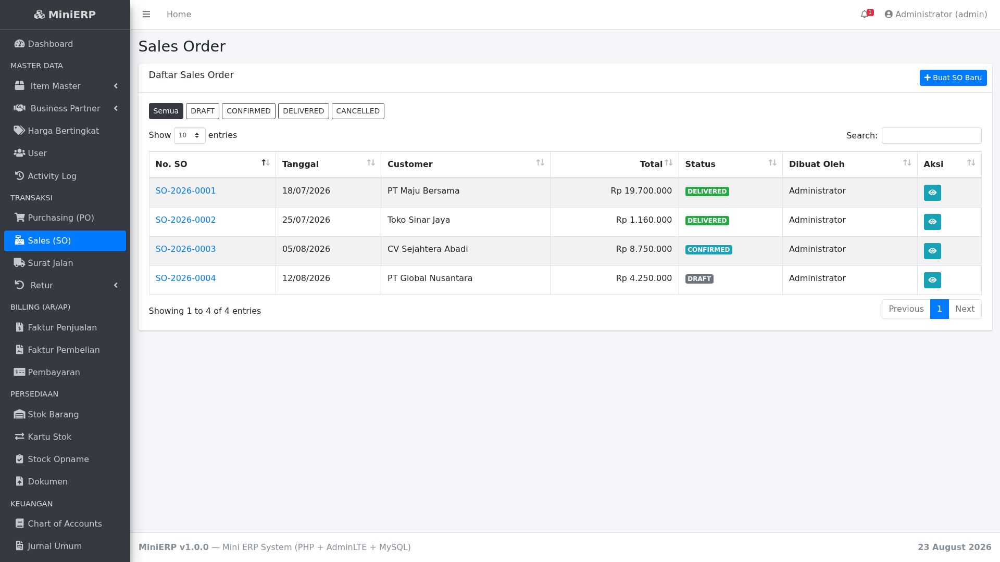

**Workflow SO: `DRAFT → CONFIRMED → DELIVERED`**

**Langkah:**
1. Klik **Buat SO Baru** → pilih customer & item → **Simpan SO**
2. Klik **Confirm Order** → CONFIRMED
3. Buat **Surat Jalan** (pengiriman parsial didukung)
4. Buat **Faktur Penjualan** (invoice) dari SO yang DELIVERED
5. Catat **Pembayaran** dari customer (bisa termin/parsial)

> 💡 Harga jual otomatis mengambil **harga bertingkat** jika customer punya harga khusus.

### 6.2 Surat Jalan (Delivery Order)

**Menu: Transaksi → Surat Jalan**

Mendukung **pengiriman parsial** — Anda bisa kirim sebagian item dulu, sisanya menyusul. Stok berkurang saat DO dibuat.

### 6.3 Retur Penjualan & Pembelian

**Menu: Transaksi → Retur**

Retur penjualan mengembalikan stok ke gudang + jurnal reversal otomatis. Retur pembelian mengurangi stok (barang dikembalikan ke supplier).

---

## 7. Inventory & Gudang

### 7.1 Stok Barang

**Menu: Persediaan → Stok Barang**

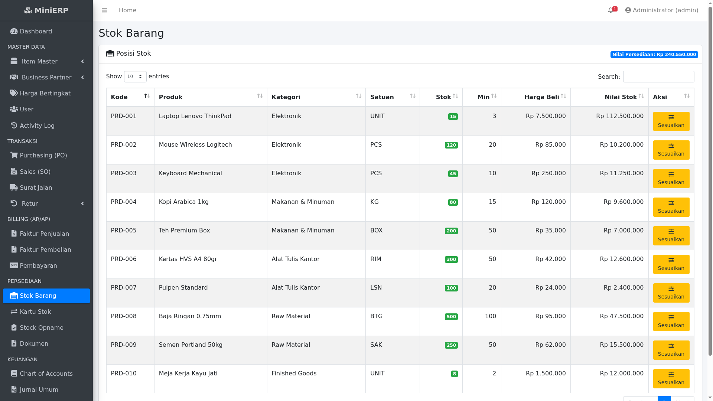

Menampilkan posisi stok real-time, nilai persediaan total, dan tombol **Sesuaikan** untuk penyesuaian stok manual (khusus admin/manager).

### 7.2 Kartu Stok

**Menu: Persediaan → Kartu Stok**

Riwayat lengkap pergerakan stok (masuk/keluar) per produk dengan referensi dokumen asal (PO/SO/Opname/Transfer).

### 7.3 Stock Opname

**Menu: Persediaan → Stock Opname**

Proses hitung fisik stok:
1. **Buat Opname** → pilih produk yang akan dihitung
2. Buka detail → isi **Qty Fisik** hasil hitung
3. Klik **Konfirmasi** → selisih otomatis disesuaikan di stok sistem

### 7.4 Multi-Gudang & Transfer Stok

**Menu: WMS → Gudang / Transfer Stok**

Kelola beberapa gudang dan pindahkan stok antar gudang dengan dokumen Transfer (workflow DRAFT → CONFIRMED).

---

## 8. Billing (Keuangan AR/AP)

### 8.1 Faktur Penjualan (AR — Piutang)

**Menu: Billing → Faktur Penjualan**

Sistem menampilkan SO yang sudah DELIVERED tapi belum ada faktur. Klik **Buat Invoice** untuk membuatnya.

Status faktur: **UNPAID → PARTIAL → PAID** (otomatis OVERDUE jika lewat jatuh tempo).

### 8.2 Pembayaran

**Menu: Billing → Pembayaran**

Catat pembayaran dari customer (RECEIVE) atau ke supplier (PAY). Pembayaran parsial/termin didukung.

> 💡 Setiap pembayaran otomatis membuat jurnal: Bank D / Piutang K (penerimaan) atau Hutang D / Bank K (pembayaran).

---

## 9. Finance & Akuntansi

### 9.1 Chart of Accounts (COA)

**Menu: Keuangan → Chart of Accounts**

Daftar akun dengan tipe: ASSET, LIABILITY, EQUITY, REVENUE, EXPENSE. Menampilkan saldo real-time per akun.

### 9.2 Jurnal Umum

**Menu: Keuangan → Jurnal Umum**

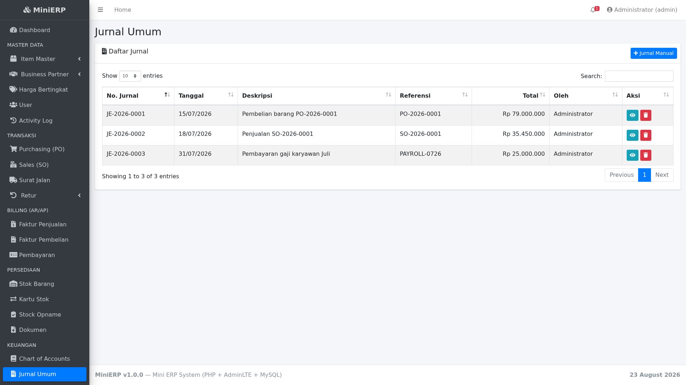

Buat jurnal manual dengan validasi **debit harus = kredit**. Semua jurnal otomatis dari transaksi (PO, SO, payroll, dll) juga tercatat di sini.

### 9.3 Buku Besar (General Ledger)

**Menu: Keuangan → Buku Besar**

Pilih akun dan periode untuk melihat semua transaksi akun tersebut dengan running balance (saldo berjalan).

### 9.4 Budget

**Menu: Keuangan → Budget**

Buat anggaran per akun per bulan, lalu bandingkan dengan realisasi (actual) dari jurnal. Menampilkan persentase penyerapan anggaran.

---

## 10. HR & Payroll

### 10.1 Karyawan, Departemen, Jabatan

**Menu: HR & Payroll → Master HR**

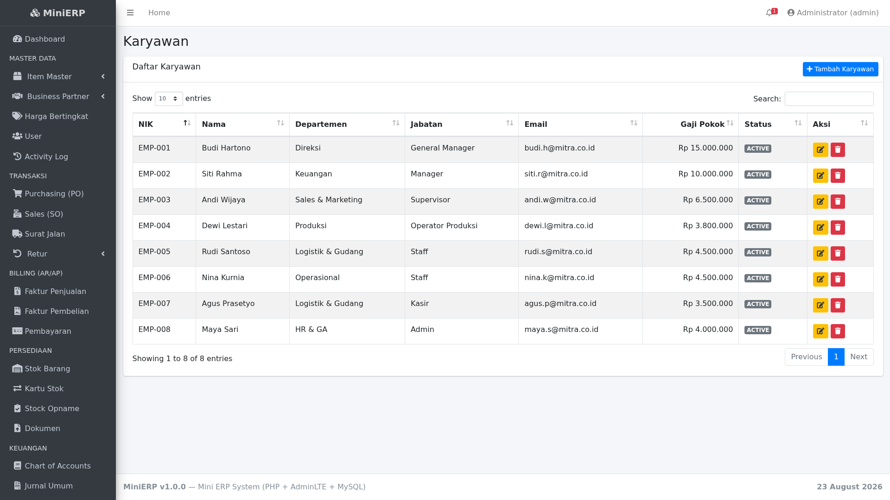

Kelola data karyawan lengkap: NIK, departemen, jabatan, gaji pokok, rekening bank.

### 10.2 Absensi

**Menu: HR & Payroll → Absensi**

Input kehadiran harian (jam masuk/keluar, status PRESENT/SICK/PERMIT/ABSENT/LEAVE) dengan rekap bulanan.

### 10.3 Payroll

**Menu: HR & Payroll → Payroll**

**Langkah membuat payroll:**
1. Klik **Buat Payroll** → pilih periode bulan
2. Sistem menghitung gaji semua karyawan aktif, dengan potongan proporsional berdasarkan absensi
3. Edit tunjangan/potongan per karyawan jika perlu
4. Klik **Approve** (manager/admin) → **Bayar**

> 💡 Saat payroll dibayar, jurnal otomatis dibuat: Biaya Gaji D / Bank K.

---

## 11. Manufacturing (Produksi)

### 11.1 Bill of Materials (BOM)

**Menu: Manufaktur → Bill of Materials**

Definisikan komposisi bahan baku per produk jadi. Contoh: 1 Meja = 2 Baja Ringan + 1 Semen.

### 11.2 Work Order (WO)

**Menu: Manufaktur → Work Order**

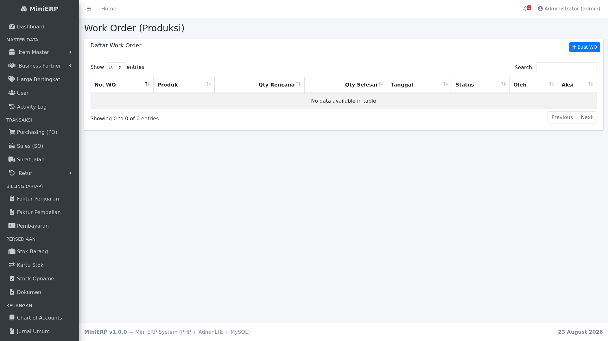

**Workflow: `PLANNED → IN_PROGRESS → COMPLETED`**

1. **Buat WO** → pilih produk jadi & qty (hanya produk dengan BOM)
2. **Mulai Produksi** → bahan baku divalidasi
3. **Selesaikan Produksi** → bahan baku berkurang, barang jadi masuk stok otomatis

---

## 12. Project Management

**Menu: Project → Project / Timesheet**

Kelola project dengan task (prioritas, deadline, assignee, progress %) dan timesheet jam kerja karyawan per project/task. Progress project otomatis dihitung dari task yang selesai.

---

## 13. POS (Kasir)

**Menu: POS & Setting → Point of Sale**

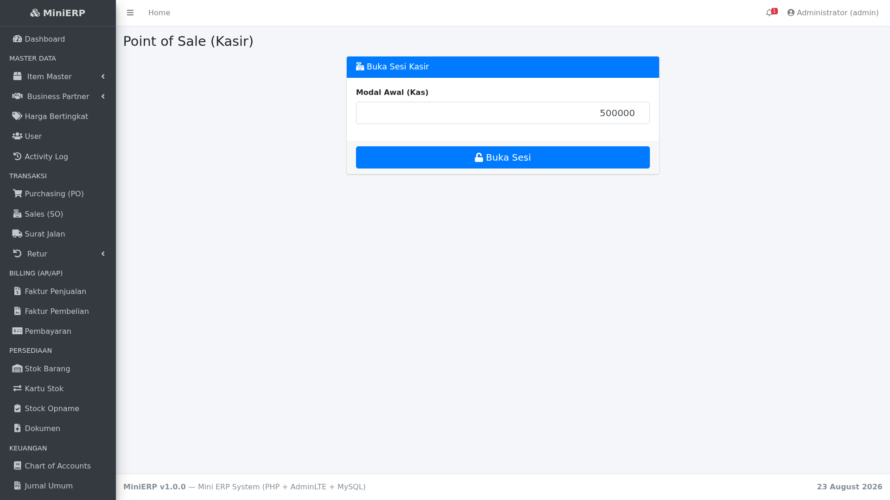

**Langkah:**
1. **Buka Sesi** → isi modal awal kas
2. Layar kasir muncul — pilih produk, qty, isi jumlah dibayar
3. Sistem menghitung kembalian otomatis
4. Klik **Proses Pembayaran** → stok berkurang + jurnal dibuat
5. **Tutup Sesi** di akhir hari — sistem membandingkan kas seharusnya vs aktual

---

## 14. CRM

### 14.1 Leads

**Menu: CRM → Leads**

Kelola prospek calon pelanggan dengan status: NEW → CONTACTED → QUALIFIED → CONVERTED/LOST. Lead yang dikonversi otomatis menjadi Customer.

### 14.2 Opportunities (Pipeline Penjualan)

**Menu: CRM → Opportunities**

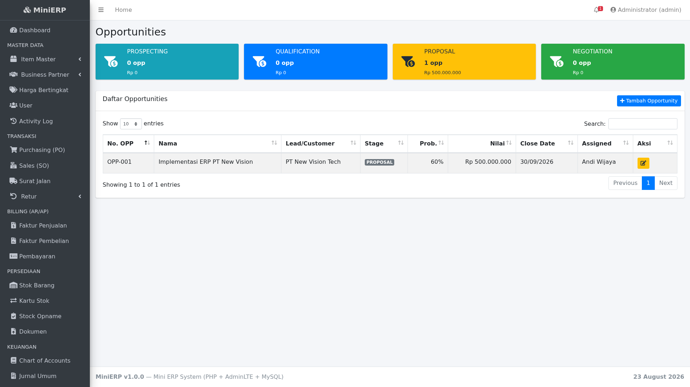

Pipeline penjualan dengan stage: PROSPECTING → QUALIFICATION → PROPOSAL → NEGOTIATION → CLOSED_WON/CLOSED_LOST, lengkap dengan probabilitas dan estimasi nilai deal.

---

## 15. Aset, QC & Lainnya

### 15.1 Aset Tetap & Penyusutan

**Menu: Aset & QC → Aset Tetap / Penyusutan**

Register aset tetap dengan penyusutan otomatis metode garis lurus. Klik **Hitung** per bulan, lalu **Posting ke Jurnal**.

### 15.2 Quality Control

**Menu: Aset & QC → Quality Control**

Inspeksi kualitas untuk barang masuk (PO), keluar (SO), atau hasil produksi (WO) dengan hasil PASSED/FAILED/PARTIAL per item.

### 15.3 Dokumen

**Menu: Persediaan → Dokumen**

Upload & kelola dokumen (kontrak, bukti bayar, dll) dengan referensi ke PO/SO/Project.

### 15.4 Lainnya

- **Mata Uang** — multi-currency dengan kurs
- **Approval Matrix** — aturan approval bertingkat berdasarkan nilai dokumen
- **Forecast & MRP** — forecast penjualan + saran kebutuhan material
- **Helpdesk** — ticket support + knowledge base
- **Activity Log** — audit trail semua aksi user

---

## 16. Laporan

**Menu: Laporan**

| Laporan | Isi | Export |
|---|---|---|
| **Penjualan** | Daftar SO per periode + produk terlaris | Print, CSV |
| **Pembelian** | Daftar PO per periode + per supplier | Print |
| **Stok** | Nilai persediaan & potensi penjualan | Print |
| **Laba Rugi** | Pendapatan vs Beban per akun | Print |

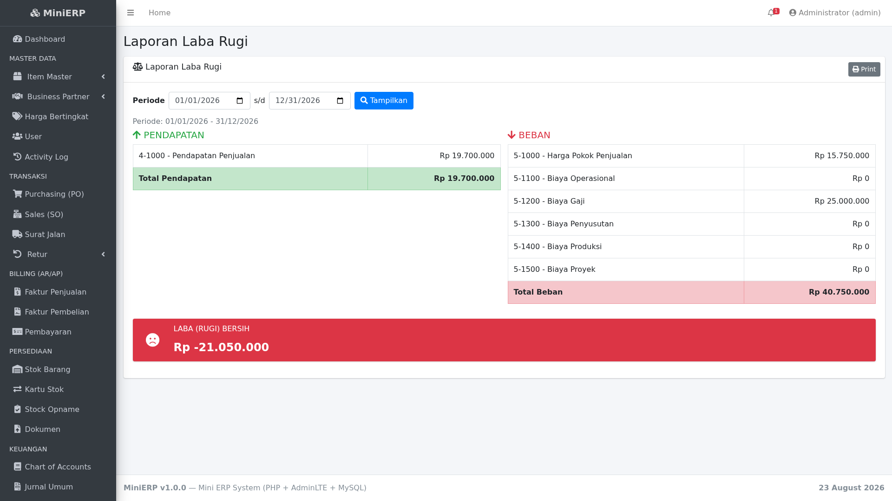

### Neraca (Balance Sheet)

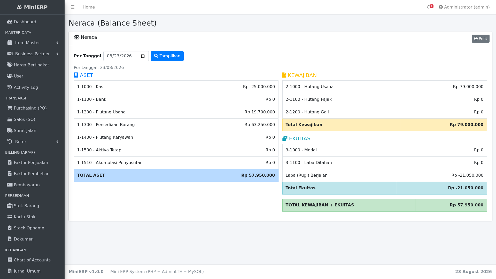

Neraca real-time: Aset = Kewajiban + Ekuitas, dengan indikator hijau jika seimbang.

---

## 17. Troubleshooting

### ❌ Error: "Access denied for user"
→ Periksa `config/config.php`, sesuaikan `DB_USER` dan `DB_PASS` dengan MySQL Anda. Di XAMPP default: user `root`, password kosong.

### ❌ Halaman kosong / 404
→ Pastikan semua file ada di satu folder dan diakses via `index.php`.

### ❌ Jurnal tidak seimbang
→ Jurnal manual wajib total debit = total kredit. Sistem menolak jika tidak seimbang.

### ❌ Stok minus / tidak cukup
→ Sistem mencegah delivery/transfer jika stok kurang. Lakukan PO dulu atau penyesuaian stok.

### Lupa password admin
Jalankan SQL ini di database untuk reset ke `admin123`:
```sql
UPDATE users SET password = '$2y$12$KO4vSnT1t34zEKScT0CG7.g7v/KWGkm9a/7suSa6bHE6Kd432aOS2' WHERE username = 'admin';
```

---

**MiniERP v4.0** — Dibangun dengan PHP + AdminLTE + MySQL
© 2026 PT Mitra Sejahtera Indonesia
